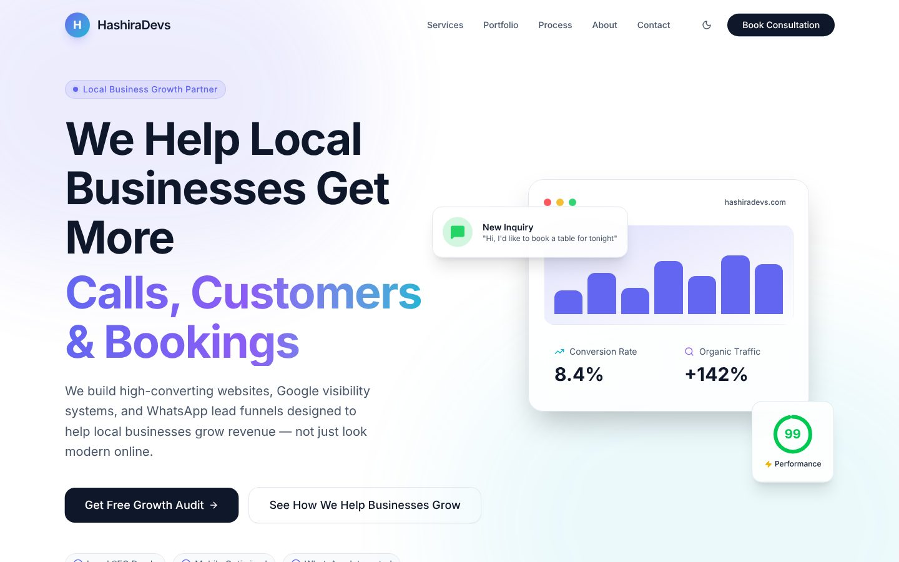
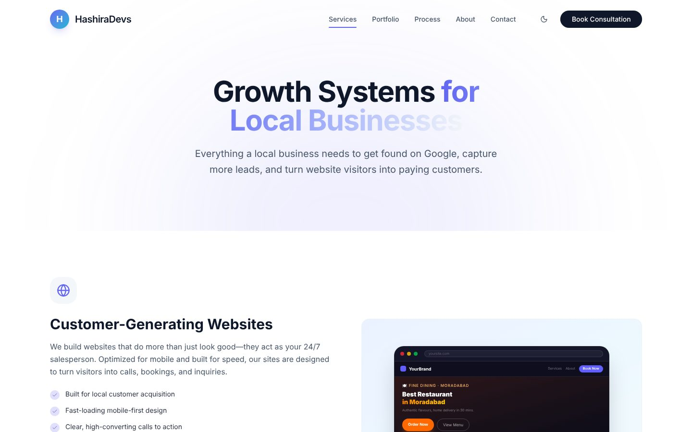
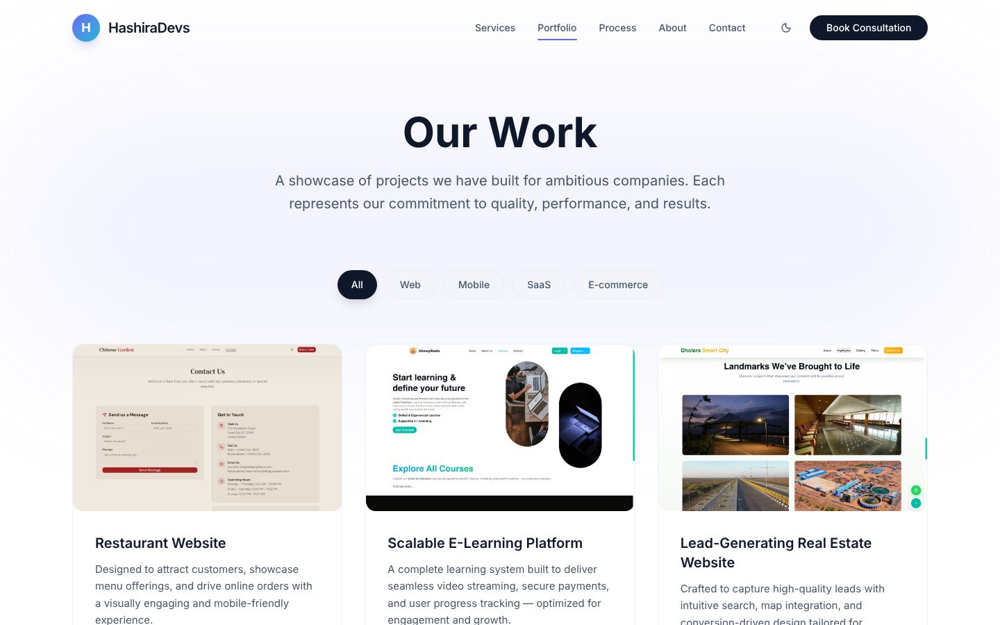

# HashiraDevs – Agency Website

The marketing website for **HashiraDevs**, a web development agency that builds websites, local SEO setups and WhatsApp lead funnels for local businesses.

**Live site:** [hashiradevs.com](https://hashiradevs.com)



---

## What's on the site

- **Home page** with hero, trust strip, services overview, industries served, work samples, process, testimonials, FAQ and call to action
- **Service pages** for each offer, each with its own content and metadata:
  - Web development (`/services/web-development`)
  - Website redesign (`/services/website-redesign`)
  - Local SEO (`/services/local-seo`)
  - Google Business Profile optimization (`/services/google-business-optimization`)
  - WhatsApp automation (`/services/whatsapp-automation`)
- **Portfolio** with category filters (Web, Mobile, SaaS, E-commerce), and a **case study page** for each project generated from one data file (`/case-study/[slug]`). A link to a project without a case study entry shows a "case study coming soon" page instead of a 404.
- **Process** and **About** pages
- **Lead capture:**
  - A contact form asking for project type, budget range and timeline. It posts to a Next.js route handler that emails the lead through the Resend API.
  - A slide-in contact sheet, a floating WhatsApp button and a sticky call-to-action bar on mobile

| Services | Portfolio | Mobile |
|---|---|---|
|  |  |  |

---

## SEO

- Page metadata (title, description, Open Graph, Twitter cards) on the home, about and service pages, with `metadataBase` set to the production domain
- JSON-LD structured data in the root layout: `LocalBusiness` / `ProfessionalService` (with address, geo-coordinates, service area and an offer catalogue), `WebSite` and `BreadcrumbList`
- `sitemap.ts` generated from the navigation config, plus `robots.ts`
- One source of truth for business details (name, domain, phone, WhatsApp link, email, address) in `components/site-data.ts`, reused by the UI, metadata and structured data

---

## Tech stack

| Area | Tools |
|---|---|
| Framework | Next.js 16 (App Router), React, TypeScript |
| UI | Tailwind CSS, shadcn/ui (Radix UI), Lucide icons |
| Motion | Framer Motion (scroll-reveal animations), Lenis smooth scrolling |
| Theming | `next-themes` light/dark mode |
| Email | Resend REST API from a route handler (`app/api/send`) |
| Analytics | Vercel Analytics |
| Hosting | Vercel |

---

## Project structure

```
app/
├── page.tsx                  # Home
├── services/                 # Services overview + one folder per service
├── portfolio/                # Filterable project grid
├── case-study/[slug]/        # Case study pages generated from constants/config.ts
├── process/, about/, contact/
├── api/send/route.ts         # Contact form → Resend
├── layout.tsx                # Global metadata + JSON-LD
├── sitemap.ts, robots.ts
components/
├── site-data.ts              # Business details and page copy
├── hero.tsx, services.tsx, work.tsx, testimonials.tsx, faq.tsx …
├── case-study/               # Case study sections and the "coming soon" view
├── contact.tsx, contact-sheet.tsx, whatsapp-button.tsx, mobile-cta-bar.tsx
└── ui/                       # shadcn/ui components
constants/config.ts           # Portfolio and case study data
```

---

## Getting started

```bash
git clone https://github.com/Param1raj/v0-saas-agency-ui.git
cd v0-saas-agency-ui
pnpm install
cp .env.example .env.local   # then fill in the values
pnpm dev                     # http://localhost:3000
```

### Environment variables

| Variable | Used for |
|---|---|
| `RESEND_API_KEY` | Sending contact-form leads via Resend |
| `RESEND_FROM_EMAIL` | Sender address (must be on a domain verified in Resend) |
| `RESEND_TO_EMAIL` | Inbox that receives new leads |

### Scripts

| Command | Description |
|---|---|
| `pnpm dev` | Start the dev server |
| `pnpm build` | Production build |
| `pnpm start` | Serve the production build |
| `pnpm lint` | Run ESLint |

### Adding a project to the portfolio

Add an entry to the array in `constants/config.ts` with a unique `id`. That `id` becomes the URL slug, so the case study appears at `/case-study/<id>` and in the portfolio grid without any other changes.

---

## Author

Designed and built by **Param Raj**, Full Stack & AI Engineer.
[LinkedIn](https://www.linkedin.com/in/param-raj-997aa41ba) · [GitHub](https://github.com/Param1raj)
